# aegis

A DNS sinkhole for focus. Blocks ads, trackers, and distracting sites for a
whole network, with per-client policy, blocklist management, schedules,
DNS rewrites, and a node graph dashboard. One static binary, pure Go, with an
embedded Solid web UI.

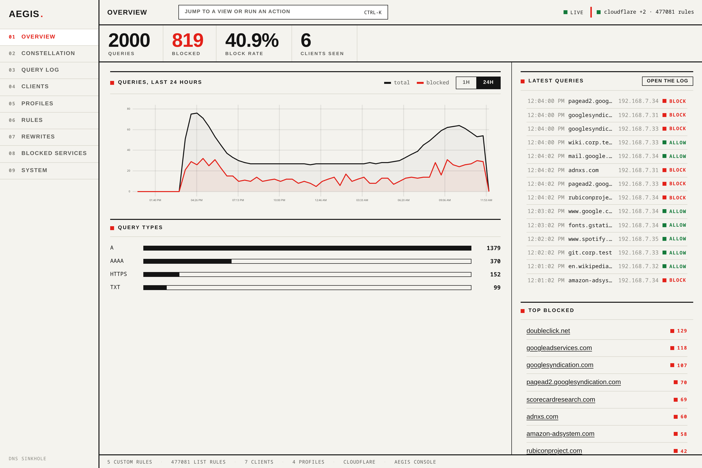

## What it does

**Blocks by list, not by hand.** Point it at the published hosts, adblock, and
domain lists it already understands, and it fetches them on a schedule, diffs
what changed, and keeps the rule set in one mirror the resolver matches against.

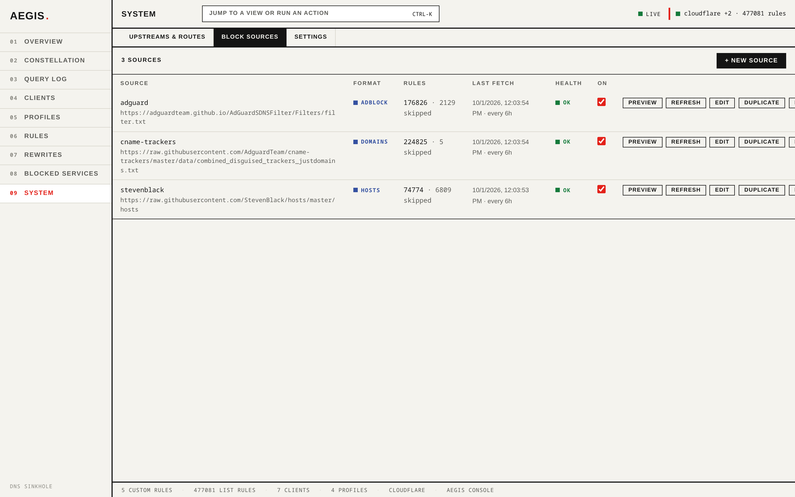

**Policy per device, not per machine.** A profile is one blocking policy: the
mode a blocked name is answered with, an optional parent to inherit from, a set
of services to block, and safe-search engines to enforce. Clients are matched by
address, hardware address, or prefix, so one profile can cover a whole guest
range. The kids profile is nxdomain with the services off; the office printer is
on the default.

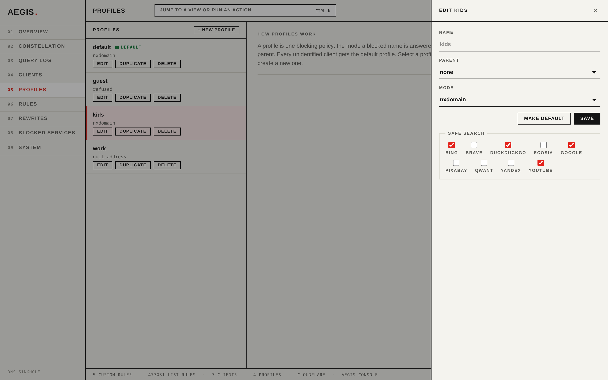

**Shows its work.** Every decision is logged with the client it came from, the
rule that matched, and the name of the list that rule came from, and the log is
filterable by any of those. Block a name you did not mean to, or allow one you
meant to block, from the log row itself.

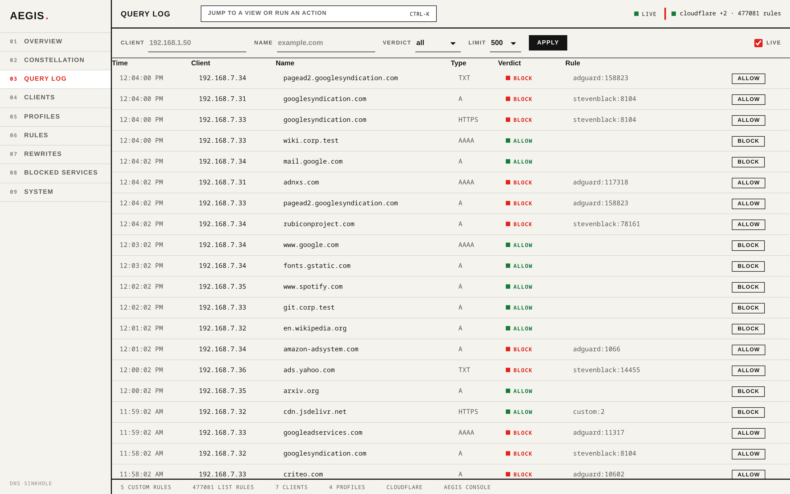

**The network as a graph.** The Constellation draws the clients, the profiles
they resolve to, the rules scoped to them, and the resolvers behind them, with
live query pulses travelling the edges. Drag a node onto another to connect a
client to a different policy.

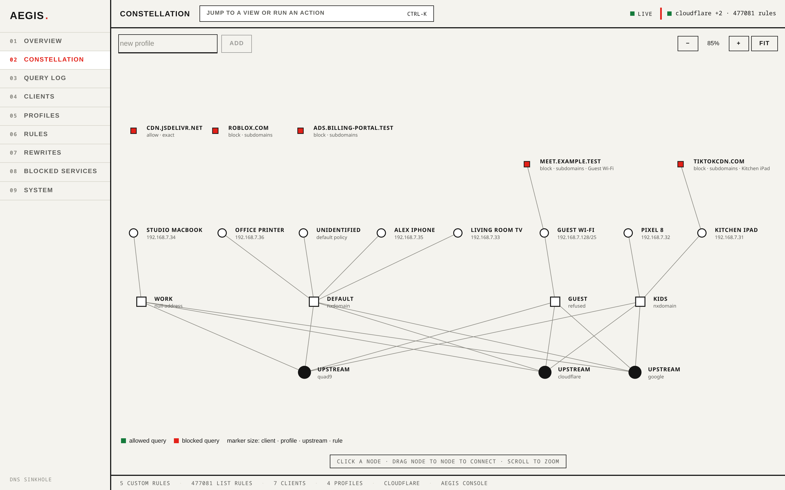

## Quickstart

Build it (the web bundle is built first and embedded):

    make tools   # once: installs goose, golangci-lint, goreleaser, sqlc
    make build

Run it:

    bin/aegis serve --dns-address 127.0.0.1:5354 --upstream 9.9.9.9:53

Open the UI at `http://127.0.0.1:8080` — profiles, clients, blocklist
sources, custom rules, and the live query stream are all there. It is one
screen of telemetry, a live feed, and a ranked list of what is blocking:

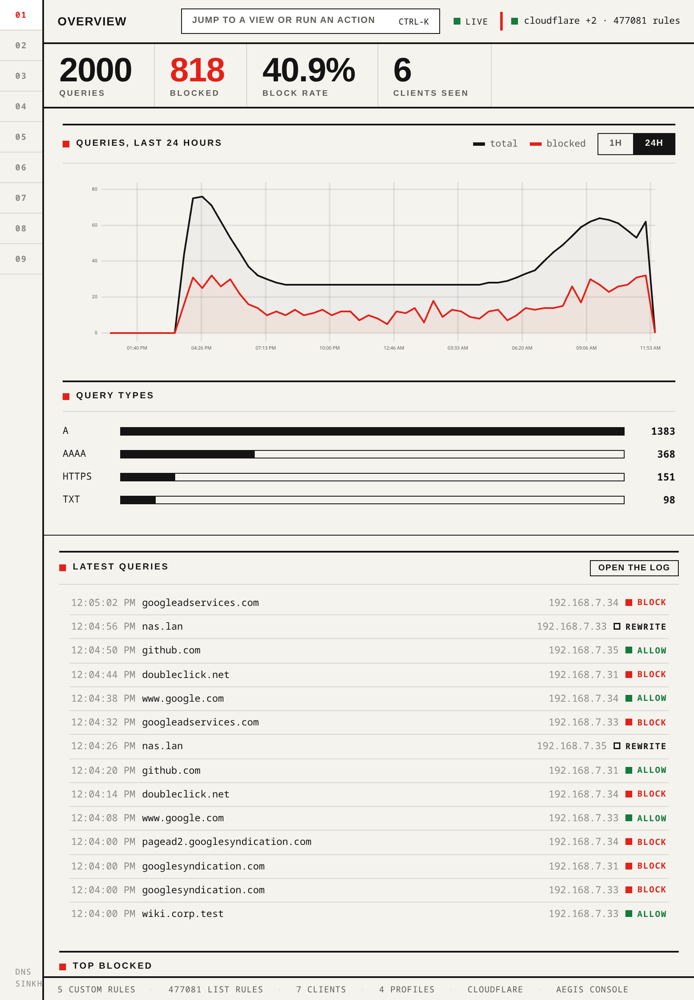

Point a device, or `dig`, at the DNS port:

    dig @127.0.0.1 -p 5354 doubleclick.net

The blocklist ships empty. Add a source in the UI (Sources tab) or at boot:

    bin/aegis serve --dns-address 127.0.0.1:5354 \
      --source stevenblack=https://raw.githubusercontent.com/StevenBlack/hosts/master/hosts

Everything configured in the UI is stored in `aegis.db` next to where you ran
the binary and survives restarts.

## More of the console

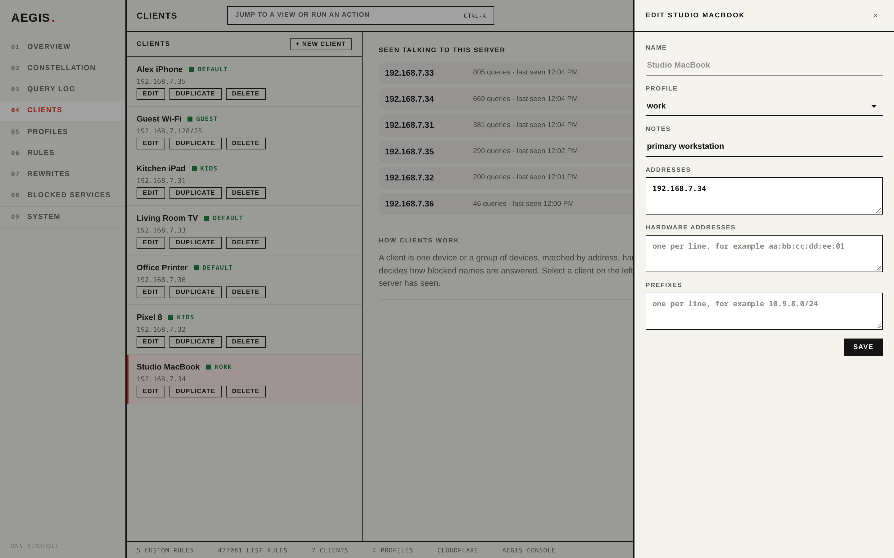

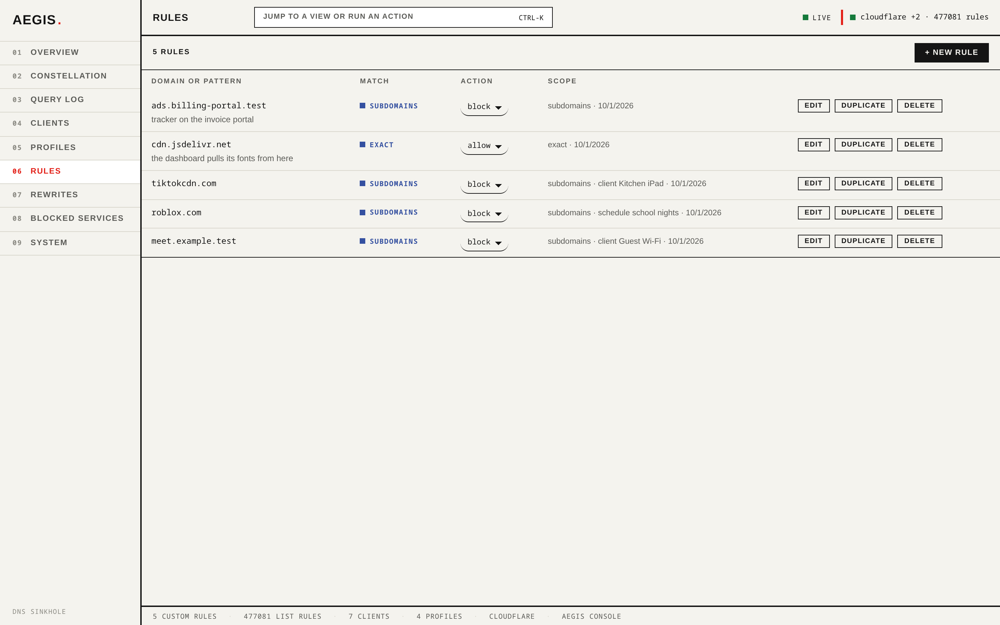

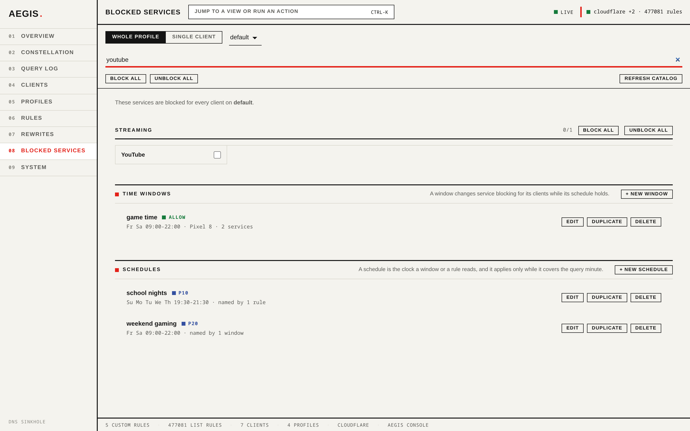

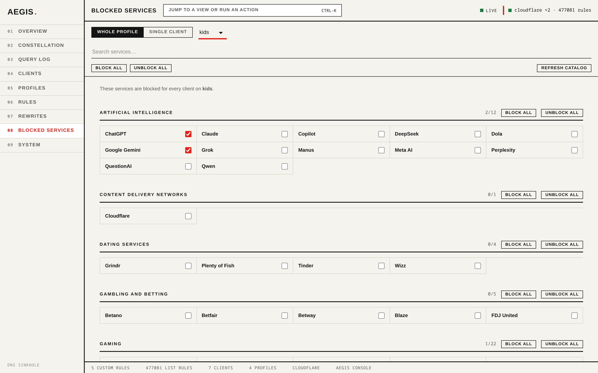

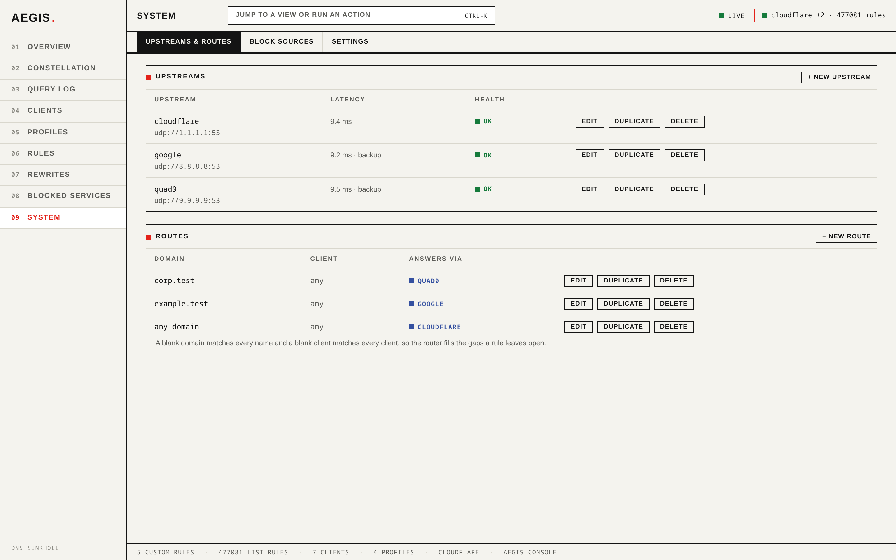

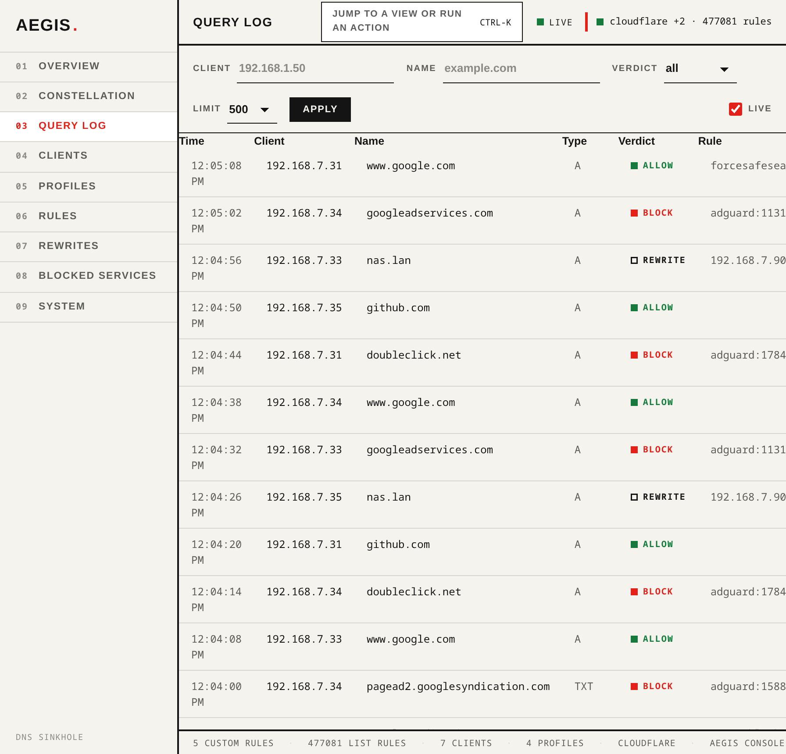

### Caveats

- Port **5353 is mDNS** on many machines. For a trial, use a free high port
  like 5354 as above; for a real deployment, use 53 (or 5354 is fine too if
  your router forwards).
- **The HTTP API has no authentication.** Keep `--api-address` on loopback or
  a trusted management network; do not expose it to the internet.
- Encrypted serving is opt-in: pass `--dot-address`/`--doh-address` together
  with `--tls-cert`/`--tls-key` (operator-supplied PEM files). See
  `docs/design/tls-serving.md`.
- Prometheus-style counters live at `/metrics` on the API listener.

## Development

    make build   # build bin/aegis, running the web bundle first
    make dev     # Vite dev server against a local aegis
    make test    # Go tests with the race detector
    make lint    # golangci-lint (run make tools first)
    make media   # regenerate the README and docs images

- The web app lives in `web/` (Solid 2 over a WebGL canvas). `npm
  --prefix web run build` after editing web sources, or `make build` embeds a
  stale bundle.
- Database changes are goose migrations in `db/migrations`; queries are sqlc
  sources in `db/query` and regenerate with `make gen`. Never hand-edit
  `internal/store/storedb`.
- Docs under `docs/` record decisions, not status: `docs/stack.md` for why
  each dependency exists, `docs/testing.md` for the five verification tiers,
  `docs/design/` for per-feature records.
- The images in this README are photographs of the real console, not mockups.
  `node scripts/media/shoot.mjs` regenerates every one: it boots the built
  binary against a throwaway database, seeds it over the real HTTP API, fetches
  the real blocklists, asks real DNS questions from six client addresses inside a
  throwaway network namespace, and photographs the result in headless Chromium
  over CDP. `--only=overview,clients` narrows the run and `--keep` leaves the
  server up to look at.

The tracker is the source of truth for what is done and what is next:
[#61 Product goals](https://github.com/McCune1224/aegis/issues/61) is the
index, and every open issue carries its own acceptance check. The target is a
feature clone of AdGuard Home first, then a superset.

## Docker

    docker build -t aegis .
    docker run -d --name aegis -p 53:53/udp -p 53:53/tcp -p 8080:8080 \
      -v aegis:/var/lib/aegis ghcr.io/mccune1224/aegis:latest

The image is a static binary on `scratch`, runs as an unprivileged user, and
keeps everything it stores in the `/var/lib/aegis` volume: mount it and the
configuration, blocklists, and query log survive upgrades. The web UI is on
port 8080, DNS on 53 (UDP and TCP). The CI `docker` job builds and tests the
image on amd64 and arm64 on every change, and a multi-arch publish for
linux/amd64, linux/arm64, linux/arm/v7, and linux/arm/v6 runs on every tag.
